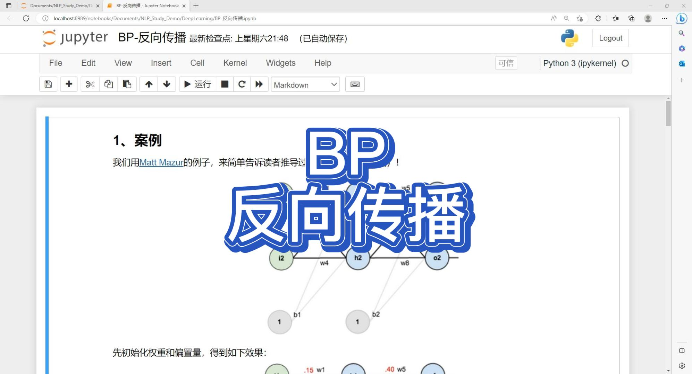
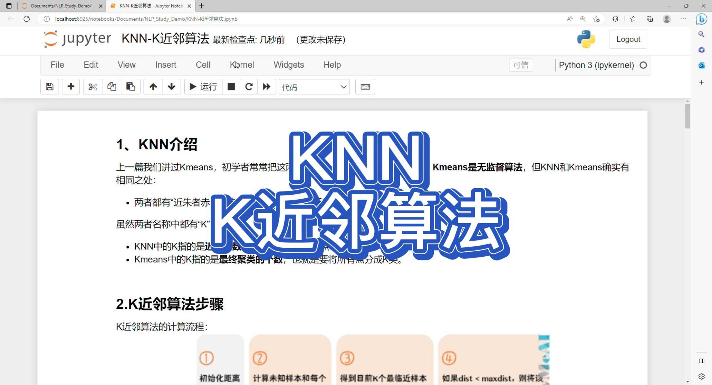
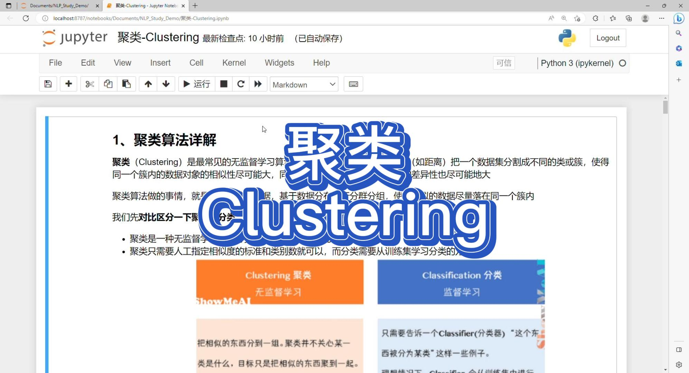
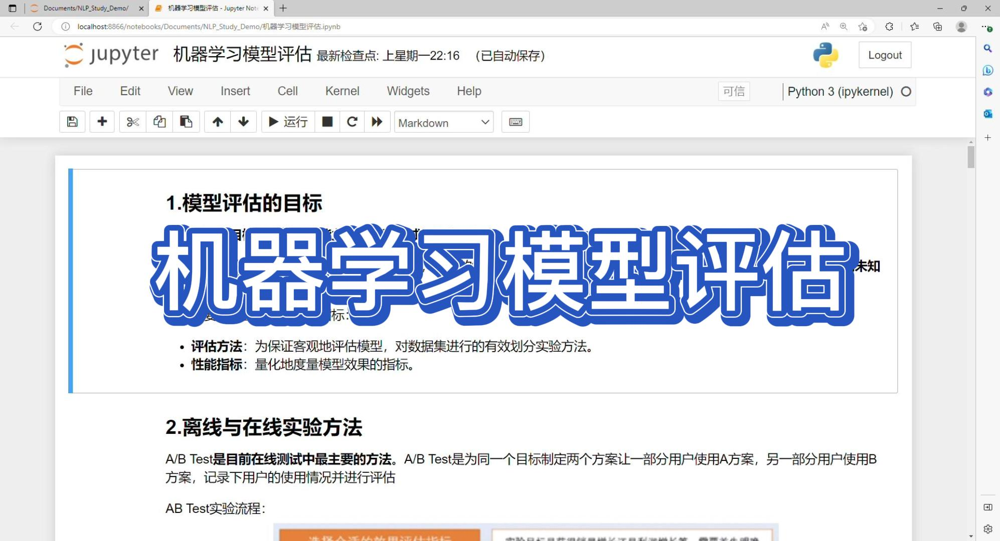
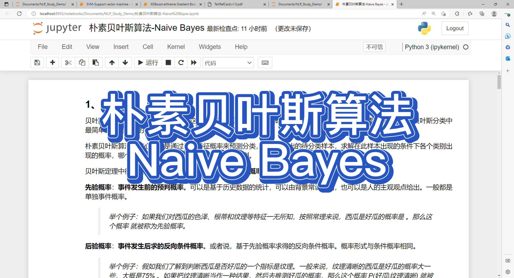
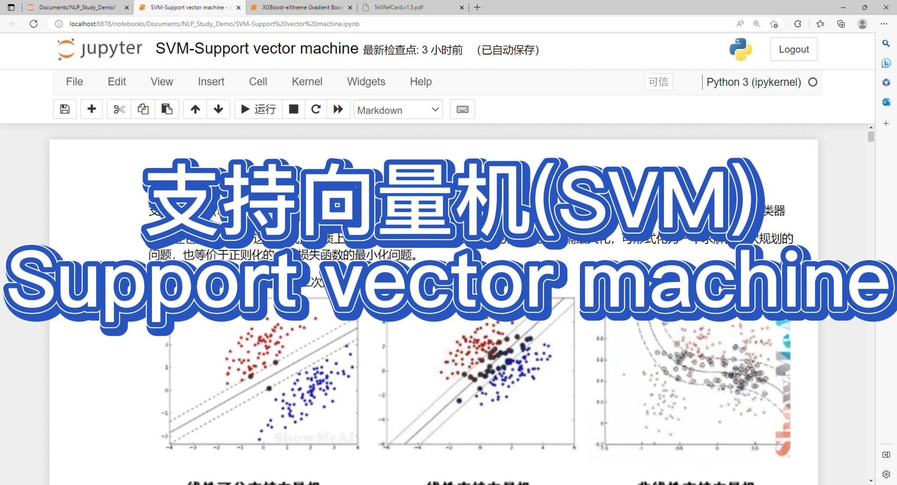
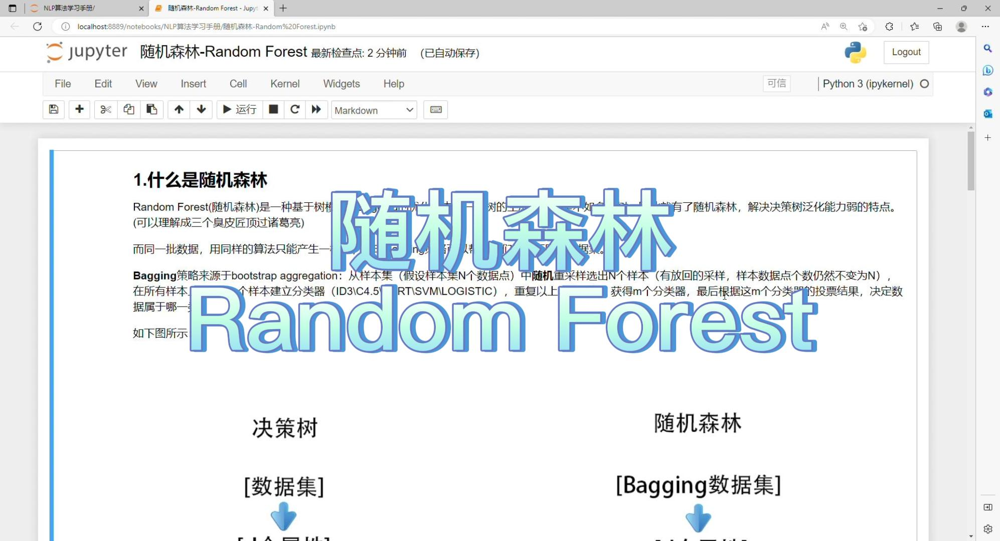

# 机器学习&深度学习教程

官网地址：https://www.aiexplorer.blog/

- AI能力私有化部署指南
- 深度学习算法原理讲解
- Pytorch深度学习算法开发教程
- Hugging face Transformer系列教程

LetsAskAI(AI助手）：http://www.aiadvice.top/

特性：
- 首次注册，免费尝鲜国内顺畅体验GPT3、GPT4、文心一言等AI大模型。
- Python、Java、Matlab、前端页面编码开发
- 论文改进思路
- AI 海报设计，广告文案生成
- 头条、抖音口播文案生成
- 可提供对外 API 服务
- 使用场景：https://w1l3qi32ze.feishu.cn/wiki/A3DSwMUr0i54YVkKWrQcunGhnef

项目介绍：https://github.com/ExpressGit/LetAsKAI

## Transformer视频

| 日期 | 标题 | 封面 | 时长 | 视频（播放数） |
| --: | -- | -- | --: | -- |
| 8/27/23 | Transformer-day06-模型微调 P-Tuning |  | 17:41 | |
| 8/24/23 | Transformer-day05-模型微调（Frezee) |  | 13:34 | |
| 8/15/23 | Transformer-day04-模型&分词器 |  | 17:29 | |
| 8/12/23 | Transformer-day03-pipeline(流水线) |  | 16:36 | |
| 8/09/23 | transformer-day02-模型详解 |  | 10:54 | |
| 8/07/23 | transformer-day01-起源&介绍 |  | 10:54 | |

## AI热点

| 日期 | 标题 | 封面 | 时长 | 视频（播放数） |
| --: | -- | -- | --: | -- |
| 8/01/23 | 【up推荐】如何零代码构建 LLM 私有化服务 |  | 07:56 | |
| 7/28/23 | 5 分钟部署免费私有化的 Llama2中文版（可商用） |  | 07:22 | |
| 5/16/23 | 如何快手上手媲美GPT4的ClaudeAI |  | 07:27 | |
| 4/27/23 | MiniGPT-4为什么可以看图说话 |  | 07:18 | |
| 4/25/23 | 快速了解ChatGPT-Academic |  | 07:18 | |
| 4/21/23 | 5分钟部署中文版ChatGLM(工程代码已优化） |  | 07:18 | |
| 4/18/23 | 5分钟一键部署万能Auto-GPT |  | 07:18 | |
| 4/16/23 | 5分钟部署免费、免翻墙、本地化ChatGPT指南 |  | 11:32 | |

## 深度学习视频

| 日期 | 标题 | 封面 | 时长 | 视频（播放数） |
| --: | -- | -- | --: | -- |
| 3/28/23 | 深度学习-02-BP-反向传播 |  | 11:32 | |
| 3/25/23 | 深度学习-01-神经网络-neural network |  | 22:08 | |

## 机器学习视频

| 日期 | 标题 | 封面 | 时长 | 视频（播放数） |
| --: | -- | -- | --: | -- |
| 3/23/23 | 通俗易懂-三哥讲机器学习-15-机器学习-K近邻算法-KNN |  | 07:39 | |
| 3/22/23 | 通俗易懂-三哥讲机器学习-14-机器学习-聚类算法-Clustering |  | 15:35 | |-EM-LossFunction |  | 14:54 | |
| 3/19/23 | 通俗易懂-三哥讲机器学习-13-机器学习-最大期望算法-EM-LossFunction |  | 14:54 | |
| 3/17/23 | 通俗易懂-三哥讲机器学习-12-机器学习-损失函数-LossFunction |  | 11:41 | |
| 3/15/23 | 通俗易懂-三哥讲机器学习-11-机器学习-模型评估 |  | 14:16 | |
| 3/14/23 | 通俗易懂-三哥讲机器学习-10-机器学习-朴素贝叶斯-Naive Bayes |  | 14:06 | |
| 3/12/23 | 通俗易懂-三哥讲机器学习-09-机器学习-支持向量机-SVM |  | 19:07 | |
| 3/11/23 | 通俗易懂-三哥讲机器学习-08-机器学习-LightGBM |  | 22:18 | |
| 3/10/23 | 通俗易懂-三哥讲机器学习-07-机器学习-XGBoost-eXtreme Gradient Boosting |  | 26:58 | |
| 3/07/23 | 通俗易懂-三哥讲机器学习-06-机器学习-回归树-Regression Tree |  | 13:38 | |
| 3/05/23 | 通俗易懂-三哥讲机器学习-05-机器学习-梯度提升决策树-GBDT |  | 11:32 | |
| 3/05/23 | 通俗易懂-三哥讲机器学习-04-机器学习-随机森林-RandomForest |  | 07:09 | |
| 3/04/23 | 通俗易懂-三哥讲机器学习-03-机器学习-决策树-DecisionTree |  | 26:05 | |
| 3/02/23 | 通俗易懂-三哥讲机器学习-02机器学习-逻辑回归-LogisticRegression |  | 10:48 | |
| 3/02/23 | 通俗易懂-三哥讲机器学习-01机器学习-线性回归-LinearRegression |  | 08:43 | |

---

