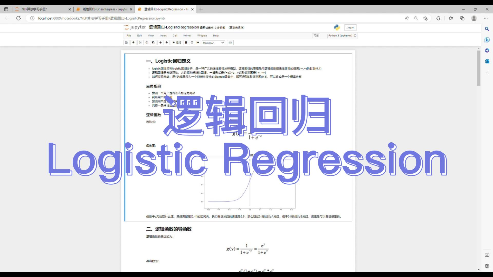

# 机器学习&深度学习教程

## 深度学习视频

| 日期 | 标题 | 封面 | 时长 | 视频（播放数） |
| --: | -- | -- | --: | -- |
| 3/28/23 | 深度学习-02-BP-反向传播 |  | 11:32 | |
| 3/25/23 | 深度学习-01-神经网络-neural network |  | 22:08 | |

## 机器学习视频

| 日期 | 标题 | 封面 | 时长 | 视频（播放数） |
| --: | -- | -- | --: | -- |
| 3/23/23 | 通俗易懂-三哥讲机器学习-15-机器学习-K近邻算法-KNN |  | 07:39 | |
| 3/22/23 | 通俗易懂-三哥讲机器学习-14-机器学习-聚类算法-Clustering |  | 15:35 | |-EM-LossFunction |  | 14:54 | |
| 3/19/23 | 通俗易懂-三哥讲机器学习-13-机器学习-最大期望算法-EM-LossFunction |  | 14:54 | |
| 3/17/23 | 通俗易懂-三哥讲机器学习-12-机器学习-损失函数-LossFunction |  | 11:41 | |
| 3/15/23 | 通俗易懂-三哥讲机器学习-11-机器学习-模型评估 |  | 14:16 | |
| 3/14/23 | 通俗易懂-三哥讲机器学习-10-机器学习-朴素贝叶斯-Naive Bayes |  | 14:06 | |
| 3/12/23 | 通俗易懂-三哥讲机器学习-09-机器学习-支持向量机-SVM |  | 19:07 | |
| 3/11/23 | 通俗易懂-三哥讲机器学习-08-机器学习-LightGBM |  | 22:18 | |
| 3/10/23 | 通俗易懂-三哥讲机器学习-07-机器学习-XGBoost-eXtreme Gradient Boosting |  | 26:58 | |
| 3/07/23 | 通俗易懂-三哥讲机器学习-06-机器学习-回归树-Regression Tree |  | 13:38 | |
| 3/05/23 | 通俗易懂-三哥讲机器学习-05-机器学习-梯度提升决策树-GBDT |  | 11:32 | |
| 3/05/23 | 通俗易懂-三哥讲机器学习-04-机器学习-随机森林-RandomForest |  | 07:09 | |
| 3/04/23 | 通俗易懂-三哥讲机器学习-03-机器学习-决策树-DecisionTree |  | 26:05 | |
| 3/02/23 | 通俗易懂-三哥讲机器学习-02机器学习-逻辑回归-LogisticRegression |  | 10:48 | |
| 3/02/23 | 通俗易懂-三哥讲机器学习-01机器学习-线性回归-LinearRegression |  | 08:43 | |

